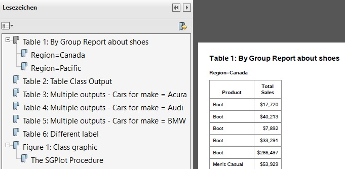
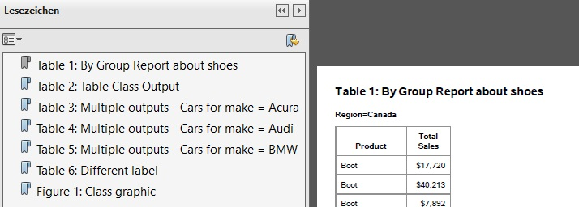
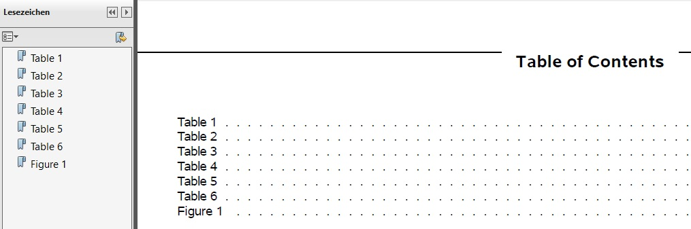
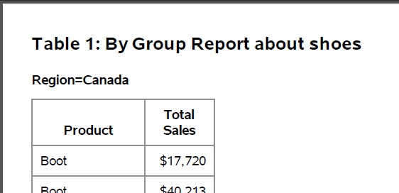
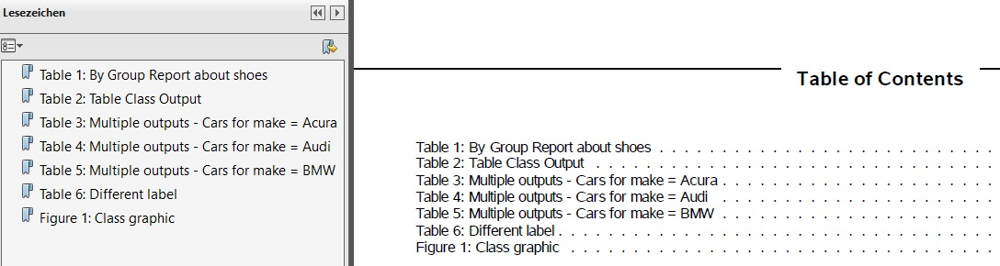
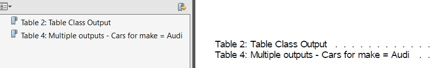
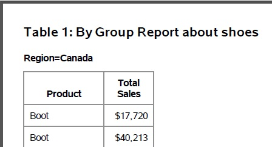
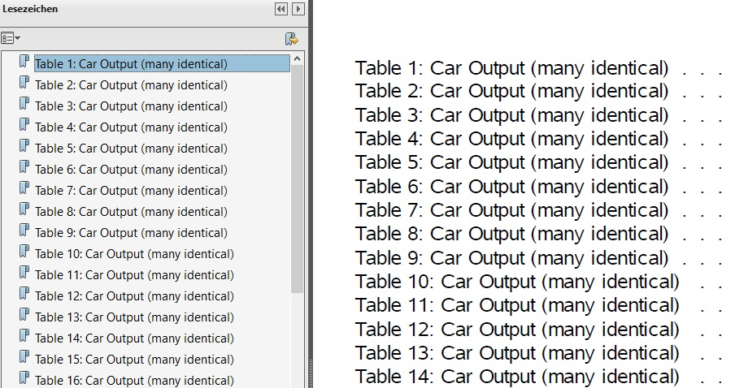

# TEST_SMILE_ODS_DOCUMENT_FLAT_LABEL

Example program for macro calls of %smile_ods_document_flat_label

 - Author     : Katja Glass
 - Creation   : 2021-02-18
 - SAS Version: SAS 9.4
 - License    : MIT
 

Initialize macros

```sas
%LET root = <path>;
OPTIONS SASAUTOS=(SASAUTOS, "&root/macros");
```

 

set options for nice layout

```sas
OPTIONS NODATE NONUMBER NOCENTER ORIENTATION=landscape;
TITLE;FOOTNOTE;
OPTIONS PS=35;
```

 


## Example 1 - empty ODS Document - warning expected


```sas
ODS DOCUMENT NAME = work.doc_empty (write);
ODS DOCUMENT CLOSE;
%smile_ods_document_flat_label(document=doc_empty);
%PUT The warning message is expected;
```

 


**Log Output:**

```
WARNING: SMILE_ODS_DOCUMENT_FLAT_LABEL - DOCUMENT (doc_empty) does not contain any observations - no action done
The warning message is expected
```


## Example 2 - not existing ODS Document - error expected


```sas
%smile_ods_document_flat_label(document=doc_notexist);
%PUT The error message is expected;
```

 


**Log Output:**

```
ERROR: SMILE_ODS_DOCUMENT_FLAT_LABEL - DOCUMENT (doc_notexist) is no existing ODS DOCUMENT. Macro will abort
The error message is expected
```


## Example 3 - create flat navigation PDF using one ODS DOCUMENT

Comment:
 
- the SAS TOC would be created a buggy linking (e.g. click "table 2" on TOC)
- this had been reported to SAS(R)- it seems to be depending on viewer and whether the PDF is maximized or not
- I am expecting no fix from SAS(R)
 
 

include program to create one ODS document containing many reports

```sas
%INCLUDE "&root/programs/example_ods_document_many_reports.sas";
```

Create direct output without any modifications - ODS Structure for DOC_RESULTS contains several levels
 

ODS Path |ODS Type |Item Label
--- | --- | ---
\Report#1 |Dir |Table 1: By Group Report about shoes
\Report#1\ByGroup1#1 |Dir |Region=Canada
\Report#1\ByGroup1#1\Report#1 |Table |
\Report#1\ByGroup2#1 |Dir |Region=Pacific
\Report#1\ByGroup2#1\Report#1 |Table |
\Report#2 |Dir |Table 2: Table Class Output
\Report#2\Report#1 |Table |
\Report#3 |Dir |Table 3: Multiple outputs - Cars for make = Acura
\Report#3\Report#1 |Table |
\Report#4 |Dir |Table 4: Multiple outputs - Cars for make = Audi
\Report#4\Report#1 |Table |
\Report#5 |Dir |Table 5: Multiple outputs - Cars for make = BMW
\Report#5\Report#1 |Table |
\Report#6 |Dir |Table 6: Different label
\Report#6\Report#1 |Table |
\SGPlot#1 |Dir |Figure 1: Class graphic
\SGPlot#1\SGPlot#1 |Graph |The SGPlot Procedure
 

```sas
ODS PDF FILE= "&root/results/ods_document_noflat1.pdf" nocontents;
PROC DOCUMENT name=doc_results; replay; QUIT;
ODS PDF CLOSE;
```

**Navigation contains two levels, e.g. BYLINE categories**

 

update the document to flatten labels

```sas
%smile_ods_document_flat_label(document=doc_results);
```

ODS Document structure is arranged flat by macro
 

ODS Path |ODS Type |Item Label
--- | --- | ---
\all#1 |Table |Table 1: By Group Report about shoes
\all#2 |Table |
\all#3 |Table |Table 2: Table Class Output
\all#4 |Table |Table 3: Multiple outputs - Cars for make = Acura
\all#5 |Table |Table 4: Multiple outputs - Cars for make = Audi
\all#6 |Table |Table 5: Multiple outputs - Cars for make = BMW
\all#7 |Table |Table 6: Different label
\all#8 |Graph |Figure 1: Class graphic
 
Create PDF out of modified ODS Document

```sas
ODS PDF FILE= "&root/results/ods_document_flat1.pdf" nocontents;
PROC DOCUMENT name=doc_results; replay; QUIT;
ODS PDF CLOSE;
```

**Navigation contains one level**

 

The following source can be used to see the structure of the ODS DOCUMENT

```sas
ODS LISTING;
PROC DOCUMENT NAME=doc_results(READ);
   LIST / levels=all details;
RUN;
ODS _ALL_ CLOSE;
```

 

 


## Example 4 - create flat navigation PDF using multiple ODS DOCUMENT - with re-labeling

Comment:
 
- a looping macro might be feasible for generic use
- the SAS TOC is created and linking correctly
- ODS PROCLABEL is ignored as the label is coming through the re-labeling
 

include program to create one multiple ODS documents - one per report

```sas
%INCLUDE "&root/programs/example_ods_document_single_reports.sas";
```

flat ODS Document structure per document, apply a specific label
 

ODS Path |ODS Type |Item Label
--- | --- | ---
\Report#1 |Dir |Table 1: By Group Report about shoes
\Report#1\ByGroup1#1 |Dir |Region=Canada
\Report#1\ByGroup1#1\Report#1 |Table |
\Report#1\ByGroup2#1 |Dir |Region=Pacific
\Report#1\ByGroup2#1\Report#1 |Table |
 

```sas
%smile_ods_document_flat_label(document=doc_res1,label=Table 1);
%smile_ods_document_flat_label(document=doc_res2,label=Table 2);
%smile_ods_document_flat_label(document=doc_res3,label=Table 3);
%smile_ods_document_flat_label(document=doc_res4,label=Table 4);
%smile_ods_document_flat_label(document=doc_res5,label=Table 5);
%smile_ods_document_flat_label(document=doc_res6,label=Table 6);
%smile_ods_document_flat_label(document=doc_res_f1,label=Figure 1);
```

ODS Documents are flat now using a short label
 

ODS Path |ODS Type |Item Label
--- | --- | ---
\all#1 |Table |Table 1
\all#2 |Table |
 
 

Create final PDF file

```sas
ODS PDF FILE= "&root/results/ods_document_flat2.pdf" CONTENTS;
PROC DOCUMENT name=doc_res1; replay; QUIT;
PROC DOCUMENT name=doc_res2; replay; QUIT;
PROC DOCUMENT name=doc_res3; replay; QUIT;
PROC DOCUMENT name=doc_res4; replay; QUIT;
PROC DOCUMENT name=doc_res5; replay; QUIT;
PROC DOCUMENT name=doc_res6; replay; QUIT;
PROC DOCUMENT name=doc_res_f1; replay; QUIT;
ODS PDF CLOSE;
```

Navigation and TOC contains one level with short bookmark labels, tables contain still full label
** **

**Bookmarks and TOC**



**First Table**


 


## Example 5 - create flat navigation PDF using multiple ODS DOCUMENT

Comment:
 
- a looping macro might be feasible for generic use
- the SAS TOC is created and linking correctly
 

include program to create one multiple ODS documents - one per report

```sas
%INCLUDE "&root/programs/example_ods_document_single_reports.sas";
```

flat ODS Document structure per document, apply a specific label
 

ODS Path |ODS Type |Item Label
--- | --- | ---
\Report#1 |Dir |Table 1: By Group Report about shoes
\Report#1\ByGroup1#1 |Dir |Region=Canada
\Report#1\ByGroup1#1\Report#1 |Table |
\Report#1\ByGroup2#1 |Dir |Region=Pacific
\Report#1\ByGroup2#1\Report#1 |Table |
 

```sas
%smile_ods_document_flat_label(document=doc_res1);
%smile_ods_document_flat_label(document=doc_res2);
%smile_ods_document_flat_label(document=doc_res3);
%smile_ods_document_flat_label(document=doc_res4);
%smile_ods_document_flat_label(document=doc_res5);
%smile_ods_document_flat_label(document=doc_res6);
%smile_ods_document_flat_label(document=doc_res_f1);
```

ODS Documents are flat now using the original TITLE label
 

ODS Path |ODS Type |Item Label
--- | --- | ---
\all#1 |Table |Table 1: By Group Report about shoes
\all#2 |Table |
 
 

Create final PDF file

```sas
ODS PDF FILE= "&root/results/ods_document_flat3.pdf" CONTENTS;
PROC DOCUMENT name=doc_res1; replay; QUIT;
PROC DOCUMENT name=doc_res2; replay; QUIT;
PROC DOCUMENT name=doc_res3; replay; QUIT;
PROC DOCUMENT name=doc_res4; replay; QUIT;
PROC DOCUMENT name=doc_res5; replay; QUIT;
PROC DOCUMENT name=doc_res6; replay; QUIT;
PROC DOCUMENT name=doc_res_f1; replay; QUIT;
ODS PDF CLOSE;
```

**Navigation contains one level with original TITLE bookmark labels**

 


## Example 6 - create flat navigation PDF using multiple ODS DOCUMENT - no entry for some items

Comment:
 
- Table 1 and Table 3 have no label and no bookmark entry, but are included in the PDF
- a looping macro might be feasible for generic use
- the SAS TOC is created and linking correctly
 

include program to create one multiple ODS documents - one per report

```sas
%INCLUDE "&root/programs/example_ods_document_single_reports.sas";
```

flat ODS Document structure per document, some should not contain a label
 

ODS Path |ODS Type |Item Label
--- | --- | ---
\Report#1 |Dir |Table 1: By Group Report about shoes
\Report#1\ByGroup1#1 |Dir |Region=Canada
\Report#1\ByGroup1#1\Report#1 |Table |
\Report#1\ByGroup2#1 |Dir |Region=Pacific
\Report#1\ByGroup2#1\Report#1 |Table |
 

```sas
%smile_ods_document_flat_label(document=doc_res1,label=,bookmarklabel=no);
%smile_ods_document_flat_label(document=doc_res2);
%smile_ods_document_flat_label(document=doc_res3,label=,bookmarklabel=no);
%smile_ods_document_flat_label(document=doc_res4);
```

ODS Documents are flat now, some using no label
 

ODS Path |ODS Type |Item Label
--- | --- | ---
\all#1 |Table |
\all#2 |Table |
 
 

Create final PDF file

```sas
ODS PDF FILE= "&root/results/ods_document_flat4.pdf" CONTENTS;
PROC DOCUMENT name=doc_res1; replay; QUIT;
PROC DOCUMENT name=doc_res2; replay; QUIT;
PROC DOCUMENT name=doc_res3; replay; QUIT;
PROC DOCUMENT name=doc_res4; replay; QUIT;
ODS PDF CLOSE;
```

Navigation and TOC for labeled entries, content of all is included in PDF
** **

**Bookmarks and TOC**



**Table 1 still in PDF**


 


## Example 7 - create flat navigation PDF using multiple ODS DOCUMENTS with custom TOC

Comment:
 
- Table 1 and Table 3 have no label and no bookmark entry, but are included in the PDF
- a looping macro might be feasible for generic use
- the SAS TOC is created and linking correctly
 

create ODS Documents and flat them

```sas
%INCLUDE "&root/programs/example_ods_document_single_reports.sas";
%smile_ods_document_flat_label(document=doc_res1);
%smile_ods_document_flat_label(document=doc_res2);
%smile_ods_document_flat_label(document=doc_res3);
%smile_ods_document_flat_label(document=doc_res4);
```

 

store the final PDF document with REPLAY options

```sas
ODS PDF FILE= "&root/results/ods_document_flat5_custom_toc.pdf" NOCONTENTS BOOKMARKGEN;
```

 

include a custom TOC, but without an anchor

```sas
PROC DOCUMENT name=doc_toc; replay; QUIT;
```

 

include tables with anchor

```sas
ODS PDF ANCHOR = 'table1_x1';
PROC DOCUMENT name=doc_res1; replay; QUIT;
ODS PDF ANCHOR = 'table2_x1';
PROC DOCUMENT name=doc_res2; replay; QUIT;
ODS PDF ANCHOR = 'table3_x1';
PROC DOCUMENT name=doc_res3; replay; QUIT;
ODS PDF ANCHOR = 'table4_x1';
PROC DOCUMENT name=doc_res4; replay; QUIT;
ODS PDF CLOSE;
```

 

**Custom TOC and flat bookmarks are available**

 


## Example 8 - create flat navigation PDF using multiple ODS DOCUMENTS - many outputs

 

create 100 ODS Documents, flat them and create the output in PDF

```sas
%INCLUDE "&root/programs/example_ods_document_single_reports_big.sas";
%MACRO do_it();
   %LOCAL i;
   %DO i = 1 %TO 100;
       %smile_ods_document_flat_label(document=doc_res&i);
   %END;
   ODS PDF FILE= "&root/results/ods_document_flat6_big.pdf" CONTENTS;
   %DO i = 1 %TO 100;
       PROC DOCUMENT name=doc_res&i; replay; QUIT;
   %END;
   ODS PDF CLOSE;
%MEND;
%do_it();
```

**Flat bookmarks are available**

